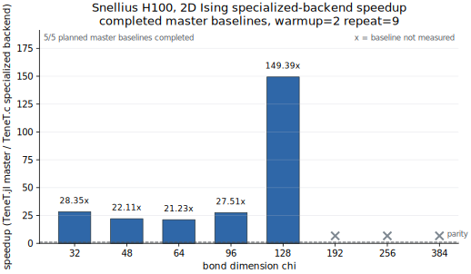
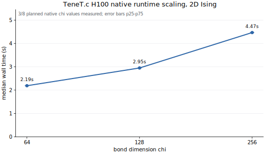
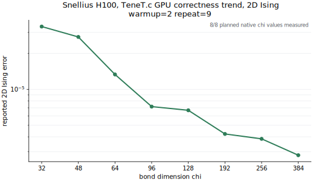

# TeneT.c

TeneT.c is a benchmark-first native backend for selected 2D Ising
TeneT-style tensor-network workloads. It depends on KrylovKit.c for the native
Krylov backend. This repository is not a complete replacement for TeneT.jl and
should not be cited as the scientific source.

```julia
using Pkg
Pkg.add(url="https://github.com/qiyang-ustc/TeneT.c", subdir="TeneTC")
```

## Acknowledgement

TeneT.jl is the scientific and API inspiration for this work. We are grateful to
Xingyu Zhang and the TeneT.jl contributors for the original implementation.
Please cite and acknowledge TeneT.jl by Xingyu Zhang and contributors when this
backend is useful in scientific work. Please also cite and acknowledge
KrylovKit.jl by Jutho Haegeman and contributors for the Krylov solver design.

Do not cite TeneT.c or KrylovKit.c as the scientific source; these repositories
are engineering backends and benchmark artifacts.

## What Is Measured

- 2D classical Ising boundary VUMPS.
- GPU TeneT.c native `CuArray{Float64}` path on H100.
- GPU TeneT.jl `master` baseline using `CuArray` at a pinned commit with a
  documented CUDA compatibility patch.
- Native runtime scaling at larger `chi` when the TeneT.jl baseline is not
  available.

`TeneTC` depends on `KrylovKitC` from
`https://github.com/qiyang-ustc/KrylovKit.c`.

## Correctness Before Speed

The release gate includes 2D Ising tensor construction, Onsager exact
references, CPU smoke tests, CUDA smoke tests when CUDA is available, native
path versus reference path parity, and checks that production defaults remain
real `Float64`.

```sh
TENETC_RUN_RELEASE_GATE=1 julia --project=TeneTC -e 'using Pkg; Pkg.test()'
```

Correctness artifacts report the VUMPS error returned by the solver and keep
the same `beta`, `tol`, `maxiter`, and seed across TeneT.jl and TeneT.c
comparisons.

## Baseline Policy

The reference baseline is TeneT.jl `master` at pinned commit
`b9ac7919a96e930639935c9370ae568139bc8747` with
`tenet_master_cuda_compat.patch`. The patch is an ecosystem-version adapter for
current CUDA/Julia packages, not a criticism of the original project.

Speedup is shown only for `chi` values where the TeneT.jl master baseline
completed. Timeout or not-measured rows are reported separately and are not
converted into speedup claims.

## Performance Evidence

All figures are generated from committed TSV artifacts:

```sh
python3 benchmarks/plots/plot_release_figures.py
```

Current public artifacts include 8 GPU TeneT.c H100 points and 5 completed GPU
TeneT.jl master H100 baseline points. Larger master baselines are explicitly
marked not measured rather than converted into speedup claims.

The completed-baseline speedup is GPU TeneT.jl master versus GPU TeneT.c on
the same H100 class, both using CUDA arrays and explicit synchronization. It is
still an end-to-end specialized-backend comparison, not a pure kernel-level
microbenchmark and not a claim about all TeneT.jl workloads.







Detailed tables, run IDs, limitations, and reproduction commands are in
`TeneTC/README.md`.

## Expanded Release Sweep

```sh
bash benchmarks/run_release_suite.sh
```

Measured matrix:

- GPU TeneT.c H100 native: `chi=32,48,64,96,128,192,256,384`, warmup 2, repeat 9.
- GPU TeneT.jl master H100 baseline: completed `chi=32,48,64,96,128`, warmup 2,
  repeat 9; `chi=192,256,384` are not measured and do not appear as speedup.

No speedup claim is made for missing, timed-out, or smoke-test rows.
