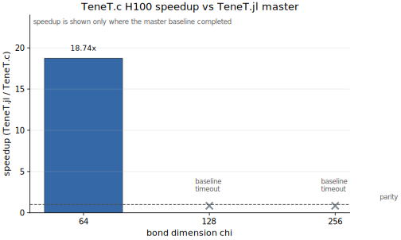
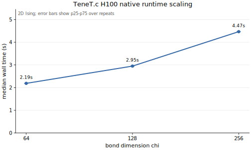

# TeneT.c

TeneT.c is a preview / benchmark artifact for native accelerated experiments on
selected TeneT-style tensor-network workloads. It is not a complete replacement
for TeneT.jl. The Julia module name is `TeneTC`.

## Acknowledgement

TeneT.jl is the scientific and API inspiration for this package. We are grateful
to Xingyu Zhang and the TeneT.jl contributors for the original implementation.
This package should be read as a specialized native backend and benchmark suite,
not as a replacement for TeneT.jl.

If this code is useful in your work, please cite and acknowledge the original
TeneT.jl work by Xingyu Zhang and contributors, and cite and acknowledge
KrylovKit.jl by Jutho Haegeman and contributors for the Krylov solver design.
Please do not cite TeneT.c or KrylovKit.c as the scientific source; these
repositories are engineering backends and benchmark artifacts.

The release benchmarks compare against a pinned TeneT.jl `master` commit. Any
CUDA compatibility patch used for the reference baseline is documented as an
ecosystem-version adapter, not as a criticism of the original project.

## Preview Scope

- 2D classical Ising boundary VUMPS.
- CPU `Float64` and CUDA `CuArray{Float64}` native fast path.
- TeneT.jl master comparison using a pinned commit and documented patch.
- Dependency on `KrylovKit.c` for generic Krylov backend ownership.

Large-cell, symmetry-sector, complex production tensors, and broad TeneT feature
coverage are intentionally out of scope for the first release.

## Basic Usage

```julia
using TeneTC

r = run_boundary(critical_beta(); chi=64, maxiter=20, maxiter_ad=0)
logz = log_partition_density(r)
```

CUDA uses the same array-type style as the implementation package:

```julia
using CUDA
using TeneTC

CUDA.allowscalar(false)
r = run_boundary(critical_beta(); chi=128, maxiter=20, maxiter_ad=0, arraytype=CuArray)
```

## Preliminary Performance

README figures are generated from compact summaries in `benchmarks/results/`,
not edited by hand. `benchmarks/results/metadata.toml` records the source run
for each artifact. The public-main H100 native run completed for
`chi=64,128,256`; the TeneT.jl master baseline completed for `chi=64` and timed
out for `chi=128,256`, so no large-size speedup headline is made.

H100 public-main runs on Snellius `gpu_h100`; TeneT.c native run
`run-e51b2476d875`, TeneT.jl master `chi=64` baseline
`run-54ccea21ccc0`, source summaries `benchmarks/results/tenetc_h100.tsv` and
`benchmarks/results/tenetc_native_h100.tsv`:

| chi | TeneT.jl master median (s) | TeneT.c median (s) | speedup | master error | TeneT.c error | status |
| ---: | ---: | ---: | ---: | ---: | ---: | :--- |
| 64 | 40.995462 | 2.188001 | 18.74x | 1.53e-5 | 1.33e-5 | measured |
| 128 | not measured | 2.948597 | n/a | n/a | 6.68e-6 | master baseline timeout |
| 256 | not measured | 4.467242 | n/a | n/a | 3.67e-6 | master baseline timeout |

The `chi=128` and `chi=256` master baseline jobs timed out at the configured
wall time, so those rows report TeneT.c native-only scaling and do not make a
speedup claim.





Generate replacement figures from release artifacts:

```sh
python3 benchmarks/plots/plot_speedup.py benchmarks/results/tenetc_h100.tsv TeneTC/docs/figures/tenetc_speedup.svg
python3 benchmarks/plots/plot_scaling.py benchmarks/results/tenetc_native_h100.tsv TeneTC/docs/figures/tenetc_scaling.svg
```

## Benchmark Rules

Formal benchmark claims must use large workloads:

- CPU: `chi=32,64,128`, warmup 2, repeat 7.
- H100: `chi=64,128,256`, warmup 2, repeat 7.

Small `chi=8` and `chi=16` runs are smoke tests and correctness checks only.
